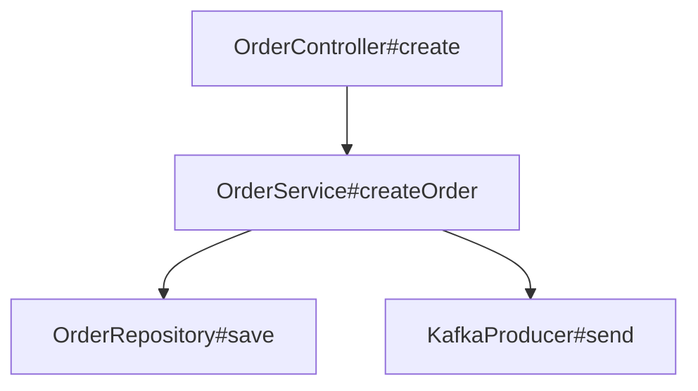

# SPEC - AI Repository Semantic Understanding Engine

## 1. 项目目标

本项目用于对本地代码仓进行结构化解析、语义聚合与文档生成。
项目可以通过 `see-code.config.json` 提供最小非敏感配置，用于控制扫描排除规则、文件大小上限和 LLM 默认 provider/model/baseUrl/cache。API key 不允许写入配置文件，必须通过 CLI 或环境变量提供。

系统目标不是简单生成 AI 总结，而是构建：

* 可递归聚合的代码语义结构
* 可查询的代码关系图
* 面向人类阅读的项目说明文档
* 面向 AI 的结构化上下文层
* 面向文档质量回归的质量报告

最终输出：

```text
输入：
  本地项目路径

输出：
  项目/docs目录下的人类工程文档
  项目/.see-code/result.json 机器可读结构化分析结果
  项目/.see-code/result-diff.json 与上一版分析结果的差异
```

例如：

```text
project/
  └─ docs/
      ├─ PROJECT_OVERVIEW.md
      ├─ MODULES.md
      ├─ BUSINESS_FLOWS.md
      ├─ CALL_GRAPH.md
      ├─ DATA_AND_RESOURCES.md
      ├─ QUALITY_REPORT.md
      └─ CHANGE_SUMMARY.md
  └─ .see-code/
      ├─ result.json
      └─ result-diff.json
```

---

# 2. 核心设计思想

系统不基于：

```text
文件树聚合
```

而基于：

```text
语义结构图聚合
```

原因：

* 文件树不等于业务结构
* 一个文件可能包含多个业务职责
* 真实业务关系是调用图而不是目录树

系统采用：

```text
AST/ATS + AI Semantic + Relation Graph
```

进行递归聚合。

---

# 3. 总体架构

```text
源码仓库
  ↓
Repo Scanner
  ↓
Tree-sitter Parser
  ↓
AST/ATS Structure Store
  ↓
MethodUnit Extractor
  ↓
Method AI Analyzer
  ↓
ClassUnit Builder
  ↓
Relation Graph Builder
  ↓
Recursive Semantic Aggregator
  ↓
Docs Generator
  ↓
/docs 输出
```

---

# 4. 技术栈

## 4.1 后端

推荐：

```text
TypeScript + LangGraph
```

原因：

* MCP生态完整
* LangGraph适合递归工作流
* tree-sitter TS生态成熟
* JSON Schema支持良好
* AI SDK 丰富

推荐技术：

```text
Node.js
TypeScript
LangGraph
tree-sitter
SQLite / PostgreSQL
zod
```

---

## 4.2 AI 层

推荐：

```text
LangChain 仅作为 LLM Adapter
```

用途：

* ChatModel
* PromptTemplate
* Structured Output
* Retry
* Streaming

不用于：

* AST管理
* 图聚合
* 核心业务结构

---

## 4.3 AST 解析

使用：

```text
tree-sitter
```

支持：

```text
Java
TypeScript
JavaScript
Go
Python
```

tree-sitter 仅负责：

* AST生成
* 节点定位
* 结构识别

不负责：

* 类型推导
* Spring语义
* 调用解析
* 业务理解

当前 MVP 状态：

```text
TypeScript / JavaScript:
  TypeScript Compiler AST adapter

Java:
  lightweight static parser adapter
  extracts classes, methods, annotations, signatures, calls, resources,
  Spring MVC routes, scheduled jobs, message listeners, persistence hints
```

解析层必须输出统一中间结构：

```text
SourceFileInfo
ModuleUnit
ClassUnit
MethodUnit
Relation Metadata
```

后续 Java 高保真解析不应改动 LLM 语义分析、关系图构建和文档生成主链路，而应替换或增强 Java Parser Adapter，将 Java 类、方法、注解、方法体、调用、资源线索转换为同样的 Unit 结构。

---

# 5. 核心数据结构

## 5.1 MethodUnit

最底层语义节点。

结构：

```text
Method AST
+ Method Semantic
+ Method Summary
+ Relation Metadata
```

示例：

```json
{
  "name": "createOrder",
  "signature": "createOrder(OrderDTO dto)",
  "summary": "创建订单并发送MQ事件",
  "calls": [
    "InventoryService.lock",
    "OrderRepository.save"
  ],
  "resources": [
    "DB:orders",
    "Kafka:order_created"
  ]
}
```

MethodUnit 包含：

* AST
* AI详细解析
* 方法摘要
* 调用列表
* 副作用
* 资源访问
* 状态变更
* 语言无关方法元数据
  * parameters
  * returnType
  * visibility
  * modifiers
  * annotations / decorators
  * frameworkHints
  * entrypointHints

其中：

```text
frameworkHints:
  描述框架语义，例如 HTTP route、HTTP client、MQ consumer、scheduled job、repository、environment 等。

entrypointHints:
  描述可作为业务流入口的线索，例如 HTTP 接口、消息消费者、定时任务、CLI 入口、测试入口等。
```

Java Adapter 必须优先填充：

```text
className
methodName
signature
parameters
returnType
visibility
modifiers
annotations
source location
method source
frameworkHints
entrypointHints
```

---

## 5.2 ClassUnit

最小聚合单元。

结构：

```text
真实类
+ 方法表
+ 方法摘要
+ 内部类表
+ 类摘要
```

示例：

```text
OrderService
├─ createOrder()
├─ cancelOrder()
└─ RetryHandler (NestedClassUnit)
```

ClassUnit 不保存：

```text
所有方法完整AI详情
```

仅保留：

```text
方法摘要与结构索引
```

避免递归爆炸。

---

## 5.3 NestedClassUnit

内部类作为递归 ClassUnit。

规则：

* 数据型内部类：合并
* 行为型内部类：独立 NestedClassUnit
* lambda/匿名类：挂载到 MethodUnit

---

## 5.4 Relation Graph

核心关系图。

节点：

```text
MethodUnit
ClassUnit
ModuleUnit
ResourceNode
```

边：

```text
calls
reads
writes
publishes
consumes
depends_on
contains
```

---

# 6. 聚合模型

## 6.1 聚合方式

系统采用：

```text
局部递归聚合
```

而不是：

```text
无限全图聚合
```

---

## 6.2 聚合规则

例如：

```text
A
├─ B
│  ├─ D
│  └─ E
└─ C
   ├─ F
   └─ G
```

规则：

```text
B 只看 D/E 摘要
C 只看 F/G 摘要
A 只看 B/C 摘要
```

即：

```text
信息向上流动
细节逐层压缩
```

---

## 6.3 聚合层级

```text
L0 MethodUnit
L1 ClassUnit
L2 ModuleUnit
L3 DomainUnit
L4 ProjectUnit
```

每层只消费：

```text
summary + metadata + relation edges
```

不重新消费原始 AST。

---

# 7. 图扩散控制

为避免无限聚合：

系统采用：

## 深度限制

```text
maxDepth
```

## 节点限制

```text
maxNodes
```

## 边权重过滤

忽略：

```text
log
utils
dto
getter/setter
```

优先保留：

```text
DB写
MQ
Redis
HTTP
状态修改
```

## 跨域限制

跨业务域仅展开有限层级。

---

# 8. LangGraph 工作流设计

## 主流程

```text
scan_repo
  ↓
parse_ast
  ↓
extract_method_units
  ↓
analyze_method_units
  ↓
build_class_units
  ↓
build_relation_graph
  ↓
recursive_aggregate
  ↓
generate_docs
```

---

## recursive_aggregate 节点

输入：

```text
当前层级 Units
```

输出：

```text
上一层级 Units
```

停止条件：

```text
达到 ProjectUnit
无 parent
节点数量稳定
达到 maxLevel
```

---

# 9. Docs 输出设计

输出目标：

```text
去AI化的人类工程文档
```

禁止：

```text
AI认为
可能
推测
根据上下文
```

采用：

```text
工程描述语言
```

---

## 输出目录

```text
/docs
  ├─ PROJECT_OVERVIEW.md
  ├─ ARCHITECTURE.md
  ├─ MODULES.md
  ├─ BUSINESS_FLOWS.md
  ├─ CALL_GRAPH.md
  ├─ ENTRYPOINTS.md
  ├─ DATA_AND_RESOURCES.md
  └─ MAINTENANCE_GUIDE.md
```

---

# 10. BUSINESS_FLOWS 示例

```text
## 创建订单流程

入口：
- POST /orders

主要步骤：
1. 校验订单参数
2. 创建订单记录
3. 锁定库存
4. 发送订单创建消息

涉及组件：
- OrderController
- OrderService
- InventoryClient
- OrderProducer
```

---

# 11. CALL_GRAPH 示例



---

# 12. 项目核心价值

本项目核心不是：

```text
AI总结代码
```

而是：

```text
构建可递归聚合的代码语义图
```

系统核心能力：

* 结构化代码理解
* 方法级语义抽取
* 图关系聚合
* 业务流生成
* 工程文档自动生成
* AI结构化上下文提供

---

# 13. 后续扩展方向

## 13.1 问题单分析

```text
Excel问题单
+ Repo Semantic Graph
→ 自动定位问题链路
```

## 13.2 Patch生成

```text
问题链路
→ Method Subgraph
→ Patch生成
```

## 13.3 教学模式

```text
项目理解
→ 分层教学
→ 业务流讲解
```

## 13.4 Agent Runtime

```text
Semantic Graph
+ AI Planner
+ Tool Runtime
```

形成：

```text
Code Reasoning Engine
```

---

# 14. 第一阶段目标

第一版目标：

```text
输入：
  本地项目路径

输出：
  docs目录工程说明
```

优先实现：

```text
MethodUnit
ClassUnit
Relation Graph
Docs Generator
```

暂不实现：

```text
自动Patch
自动修复
复杂类型推导
全量编译器语义
```

---

# 15. 项目定义

本项目定义：

```text
基于 AST/ATS 与 AI 语义聚合的
代码仓库结构化理解与文档生成引擎
```
